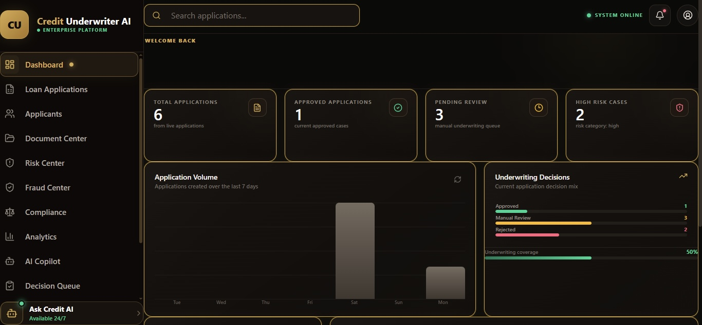
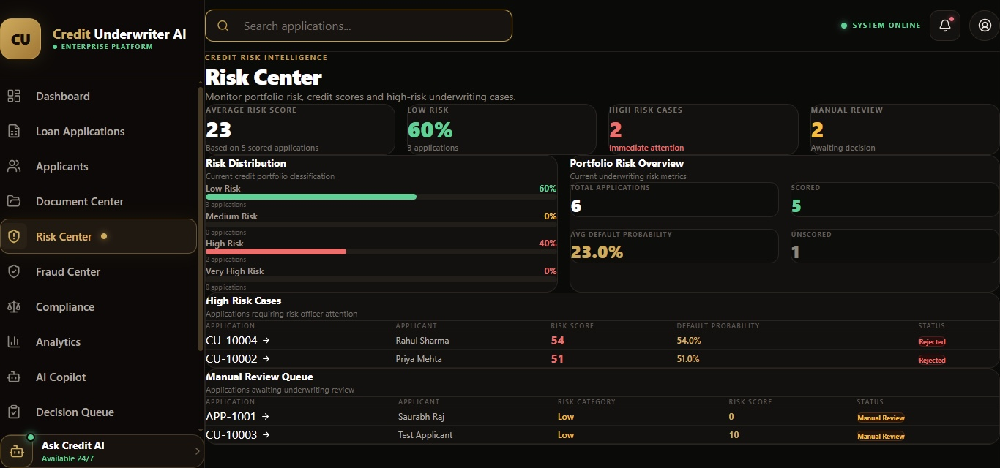
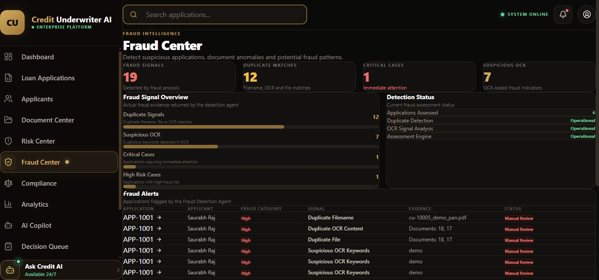
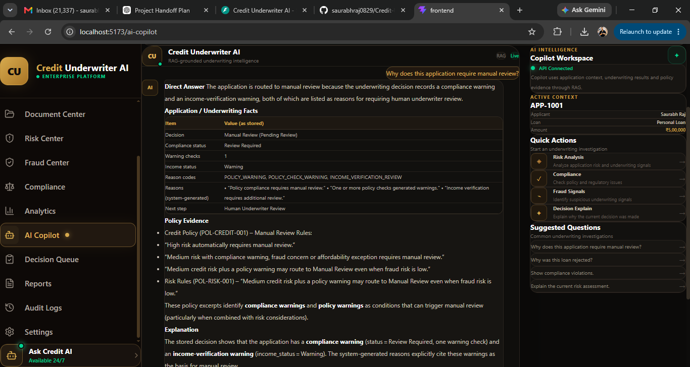
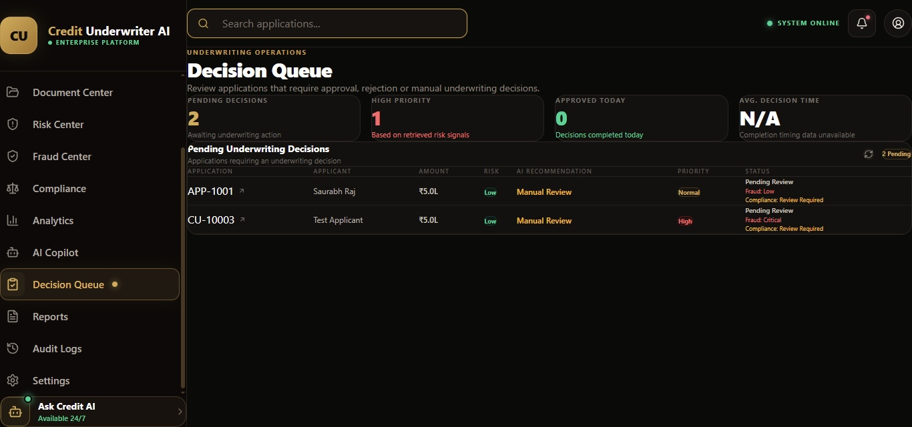

# Credit Underwriter AI

An AI-powered credit underwriting platform designed to support loan assessment through document processing, verification, machine learning-based risk analysis, policy compliance, and decision support.

## 1. Overview

Credit Underwriter AI combines a React dashboard with a FastAPI backend to streamline important stages of the credit underwriting workflow.

The platform is designed to support:

- Loan application management
- Document intake and OCR-based extraction
- Income and bank-statement verification
- Credit-risk assessment using machine learning
- Fraud and policy-compliance checks
- Loan decision support
- Executive report generation
- Audit logging and decision persistence
- An AI Copilot using Agentic AI, LLM tool calling, and RAG components

> **Note:** This is a portfolio and development project. It is not intended to make legally binding lending decisions or replace review by qualified financial professionals.

## 2. Key Features

### 2.1 Loan Application Management

- Create and manage loan applications
- Review applicant information
- Track underwriting progress
- View application-level decision details

### 2.2 Document Processing

- Applicant document intake
- OCR-based extraction
- Document verification workflows
- Income and bank-statement analysis

### 2.3 AI/ML Underwriting

- Credit-risk feature engineering
- Machine-learning-based risk assessment
- Fraud-detection workflow
- Income verification
- Policy and compliance checks
- Loan decision orchestration

### 2.4 Agentic AI Copilot

The AI Copilot is implemented as an Agentic AI component that combines:

- LLM-based reasoning
- Tool calling
- Application-data tools
- Retrieval-Augmented Generation (RAG)
- Policy and knowledge-base retrieval
- ChromaDB vector storage
- Grounded responses
- Graceful fallback handling

The AI Copilot is intended to help users inspect underwriting information and obtain context-aware decision-support explanations.

It does not independently make the final lending decision. The underwriting decision is handled by the dedicated Loan Decision Agent within the underwriting workflow.

## 3. Governance and Auditability

- Underwriting audit records
- Decision persistence
- Audit-log APIs
- Compliance-oriented workflow separation
- Decision-governance test coverage

## 4. Technology Stack

### 4.1 Frontend

- React
- TypeScript
- Tailwind CSS
- Vite

### 4.2 Backend

- Python
- FastAPI
- SQLAlchemy
- PostgreSQL
- Uvicorn

### 4.3 AI/ML and Agentic AI

- scikit-learn
- LangChain
- LangChain-Groq
- Groq LLM integration
- Agentic AI workflows
- LLM tool calling
- OCR processing
- Retrieval-Augmented Generation (RAG)
- ChromaDB

## 5. High-Level Architecture

```text
                        React + TypeScript Frontend
                                     |
                                     v
                            FastAPI Backend
                                     |
                                     v
                    Underwriting Coordinator Agent
                                     |
        +----------------------------+----------------------------+
        |                            |                            |
        v                            v                            v
Document Processing          Risk & Decision              Agentic AI Copilot
& Verification                Assessment
        |                            |                            |
        v                            v               +-------------+-------------+
Document Intake Agent      Credit Risk Agent         |                           |
        |                            |               v                           v
        v                            v            Groq LLM                 9 Read-Only Tools
OCR Extraction Agent        Fraud Detection Agent  (tool-calling loop)             |
        |                            |                          |          +---------+---------+
        v                            v                          |          |                   |
Document Verification      Policy Compliance Agent              |          v                   v
Agent                                |                          |    PostgreSQL           ChromaDB
        |                            v                          |                           |
        v                  Loan Decision Agent                   +--------------------------+
Income Verification                  |                                        |
Agent                                v                                        v
        |                  Underwriting Decision                     Copilot Answer
        +-------------+--------------+                                        |
                       |
                       v                                                      v
        +--------------+--------------+                          Returned to Frontend
        |              |              |
        v              v              v
Underwriting     Executive Report  Notification
Audit Agent          Agent            Agent
        |              |              |
        +--------------+--------------+
                       v
              Final Workflow Result

## Architecture Notes

- The Underwriting Coordinator Agent orchestrates the complete underwriting workflow as a **fixed, sequential Python pipeline** — not a LangGraph state machine and not an LLM-driven planner.
- The specialized agents perform document processing, verification, risk assessment, fraud detection, compliance checks, and loan decision assessment. **These 11 agents are fully deterministic** — rule-based logic and a scikit-learn RandomForest risk model, with no LLM involved.
- The Credit Risk Agent's model is trained on a small, hardcoded synthetic dataset for development purposes and is not yet backed by a validated production dataset.
- The Underwriting Audit Agent records and explains important underwriting information.
- The Executive Report Agent generates an executive-level underwriting report.
- The Notification Agent prepares relevant underwriting status notifications.
- The Agentic AI Copilot is the **only component in the system that calls an LLM**. It provides context-aware assistance through LangChain tool-calling, 9 read-only application-data tools, and RAG retrieval over a ChromaDB vector store of 8 policy documents.
- The final lending decision is handled by the Loan Decision Agent and is not independently made by the AI Copilot — the Copilot only explains and analyzes, it never approves, rejects, or overrides a decision.
- The diagram represents the high-level logical architecture. Actual execution and data flow are implemented in the backend code.

6. Project Structure
Credit-Underwriter-AI/
├── backend/
│   ├── ai/
│   │   ├── agents/
│   │   ├── llm/
│   │   ├── ml/
│   │   ├── rag/
│   │   └── tools/
│   ├── api/
│   ├── database/
│   ├── models/
│   ├── services/
│   ├── main.py
│   └── requirements.txt
├── frontend/
│   ├── public/
│   └── src/
├── docs/
│   └── rag_knowledge_base/
├── backend_structure.txt
├── coordinator_persistence_test.py
├── decision_governance_test.py
├── .gitignore
└── README.md

7. Local Setup
7.1 Clone the Repository
git clone https://github.com/saurabhraj0829/Credit-Underwriter-AI.git
cd Credit-Underwriter-AI
7.2 Backend Setup

For Windows PowerShell:

cd backend
python -m venv .venv
.\.venv\Scripts\Activate.ps1
python -m pip install -r requirements.txt

Create a local .env file and configure the required database, LLM, and application settings.

Start the backend:

uvicorn main:app --reload

Backend API URL:

http://127.0.0.1:8000

FastAPI documentation:

http://127.0.0.1:8000/docs
7.3 Frontend Setup

Open another terminal:

cd frontend
npm install
npm run dev

Vite will display the local frontend URL in the terminal.

8. Configuration

Depending on the enabled features, the application may require:

PostgreSQL database connection
Groq API access
Application environment settings
RAG knowledge-base paths
Document-processing settings

Keep secrets in local environment variables.

Never commit API keys, passwords, database credentials, or other sensitive configuration values.

9. Testing

The repository includes scripts related to:

Coordinator persistence
Decision governance

Run the applicable tests or scripts according to their implementation and local environment configuration.

10. Security Notes
Do not upload real Aadhaar, PAN, salary-slip, bank-statement, or other personally identifiable documents.
Use synthetic or anonymized documents for development and demonstrations.
Keep .env files, API keys, credentials, and database secrets out of version control.
Review access controls before deploying the application.
Use secure document storage and appropriate access restrictions in production.
11. Current Scope

This project demonstrates an integrated credit-underwriting workflow with:

AI agents
Agentic AI assistance
Machine learning
Document processing
OCR
RAG
Tool calling
Risk analysis
Fraud detection
Policy compliance
Decision support
Auditability and persistence

Production deployment would require additional work, including:

Comprehensive automated testing
Strong authentication and authorization
Secure document storage
Encryption and key management
Model validation and monitoring
Regulatory and legal review
Human-in-the-loop approval controls
Production-grade observability and deployment
12. Future Enhancements
Docker and Docker Compose deployment
Role-based access control
Advanced model monitoring
Explainable AI dashboards
More robust document validation
Cloud deployment
CI/CD automation
Expanded test coverage
Improved Agentic AI tool orchestration
Enhanced RAG knowledge-base management
13. Author

Saurabh Raj

GitHub: saurabhraj0829

## 📸 Application Screenshots

### Dashboard


### Risk Center


### Fraud Center


### AI Copilot


### Decision Queue
